# HOYSALA VILLAGE RESTAURANT

The Hoysala village Restaurant website is a landing page for food lovers.  
Restaurant is located in the heart of forest. Restaurant offers a variety of foods and its location allows you to enjoy their services while surrounded by the forest nature.

The purpose of this website is to promote Hoysala village Restaurant and to provide information to the customers about the food, its services and contact options. The website targets an audience of new customers looking for the typical local food as well as returning customers looking to book a table or find out about their new services.

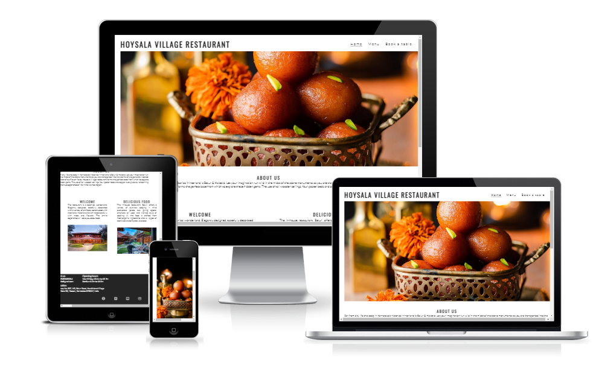

## Features

 ### General

 * Responsive design across all device sizes.
 * Similar color scheme and design throughout all pages to effectively structure, categorise and present the information to the customers.

 ### Header

  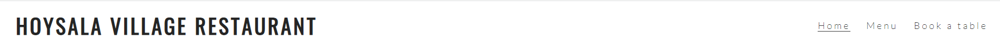

 * The header contains the business logo and fully responsive navigation bar positioned across the top  right of the screen.

 * The business logo functions as a link to the home page.

 * The navigation bar is identical in all pages and contains links to all pages to facilitate navigation across the site. It also has a hover effect that changes color to  
   provide feedback to the customer for a better user experience.

 ### Footer

  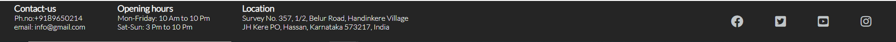

  * The footer Contains a text with useful geographical information as well as Opening hours and contact details such as the business' physical address, email and phone number  and link to the business' social media channels.

### Home Page

* **Main image**

  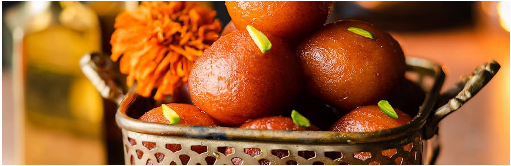

   - The main image is designed to attract the customer's attention with delicious sweet called Jamoon.

* **About Us Section**

  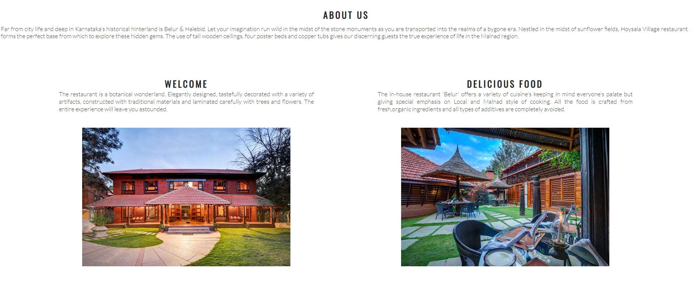

   - Contains a text with information about the business as well as an eye-catching images.

### Menu Page

* **Starters**
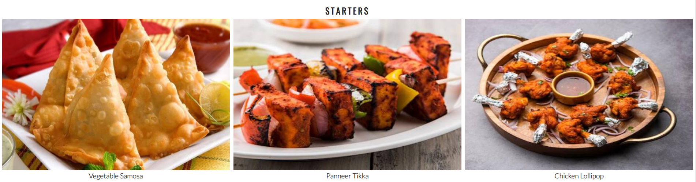

    - The section contains an image to illustrate the respective indian food starters and a short text with an name of the that starters.

* **Main course**

  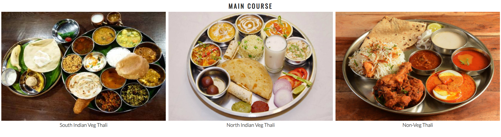

    - The section contains an image to illustrate the respective indian main course food  and a short text with an name of the that food.

### Book Now Page

* **Book Now Form**

  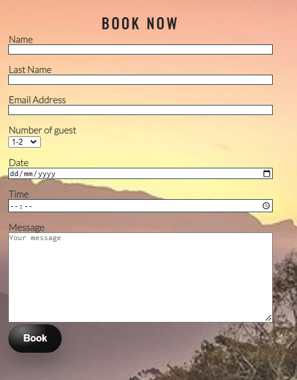

    - The form allows the customer to book the table on a specific date directly from the business' website.

* **Find Us Section**
 
  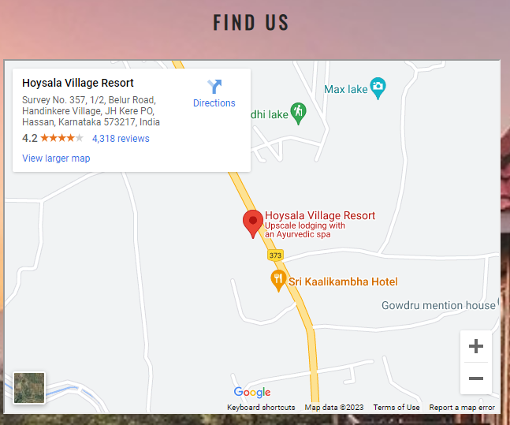

    - This section displays a Google map of the business' geographical location. This allows the customers to easily find the location from their devices.

[Back to top ⇧](#HOYSALA-VILLAGE-RESTAURANT)  

## Technologies Used

### Languages Used
* [HTML5](https://en.wikipedia.org/wiki/HTML5)
* [CSS3](https://en.wikipedia.org/wiki/CSS)

### Frameworks, Libraries and Programs Used

* [Google Fonts](https://fonts.google.com/)
    - Google Fonts was used to import the fonts oswald and lotto into the style.css file. These fonts were used throughout the site.

* [Font Awesome](https://fontawesome.com/)
     - Font Awesome was used throughout all pages to add icons in order to create a better visual experience for UX purposes.

* [photopea](https://www.photopea.com/)
    - TinyPNG was used to reduce the file size of the images for the website.

* [GitPod](https://gitpod.io/)
     - GitPod was used for writing code, committing, and then pushing to GitHub.

* [GitHub](https://github.com/)
     - GitHub was used to store the project after pushing.

* [Balsamiq](https://balsamiq.com/)
     - Balsamiq was used to create the wireframes during the design phase of the project.

* [Am I Responsive?](http://ami.responsivedesign.is/#)
    - Am I Responsive was used in order to see responsive design throughout the process and to generate mockup imagery to be used.

* [Chrome DevTools](https://developer.chrome.com/docs/devtools/)
    - Chrome DevTools was used during development process for code review and to test responsiveness.

* [W3C Markup Validator](https://validator.w3.org/)
    - W3C Markup Validator was used to validate the HTML code.

* [W3C CSS Validator](https://jigsaw.w3.org/css-validator/)
    - W3C CSS Validator was used to validate the CSS code.

### Code Validation

* The [W3C Markup Validator](https://validator.w3.org/) and [W3C CSS Validator](https://jigsaw.w3.org/css-validator/) services were used to validate all pages of the project in 
  order to ensure there were no syntax errors.

  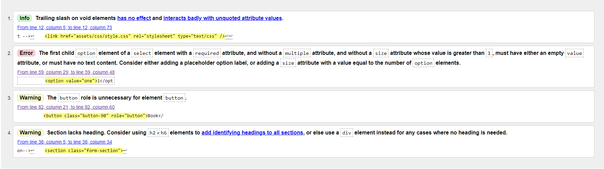

    - For book now page W3C Markup Validator found an error concerning The first child option element of a select element with a required attribute and without a size attribute whose value is greater than 1. The error was resolved by adding the size attribute with value lesser than 1. 
    - For book now page W3C found an warning concerning unnecessary role for element. the attribute role was removed from the elment to correct this. 
    - W3C Markup Validator found an warning concerning Section lacks heading. The section tag was replaced for a div tag to correct this. 

    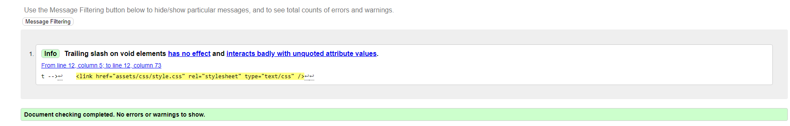
       
    -  W3C CSS Validator found no errors or warnings on my CSS.

### Accessibility

 * Used Lighthouse in Chrome DevTools to confirm that the colors and fonts being used in throughout the website are easy to read and accessible.

 * Lighthouse reports

    - **Home Page**

    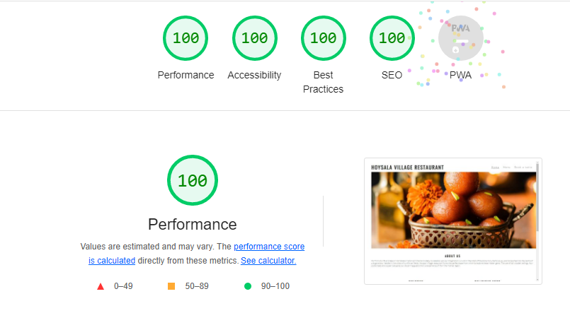

    - **Menu Page**

    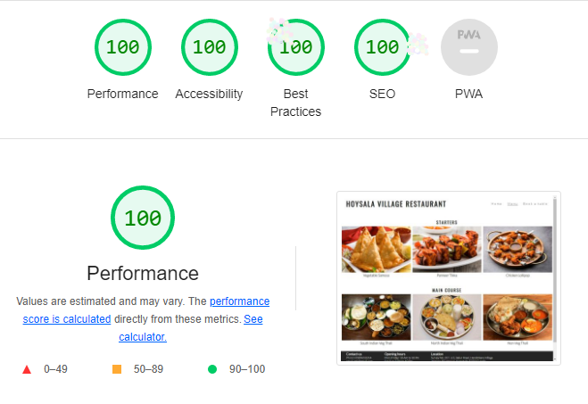

    - **Book Now Page**

    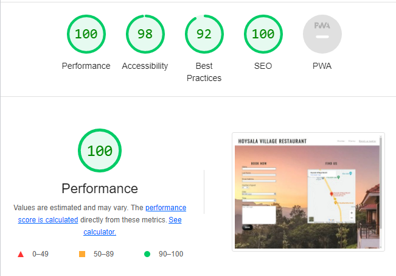

### Manual Testing

* Browser Compatibility

    - The website has been tested on the following browsers:

        - **Goolgle Chrome**
        
        No appearance, responsiveness nor functionality issues.

        - **Microsoft Edge**
        
        No appearance, responsiveness nor functionality issues.

* Common Elements Testing

    - All Pages
        
        - **Header**

            - Clicking on the main logo will bring the customer back to the home page.

        - **Navigation Bar**

            - Hovering on the different navigation bar's links will trigger hover effect, highlighting the link for the customer.

            - Clicking on the navigation bar's links will bring the customer to the specified page.
        
        - **Footer**
        
            - Clicking on the social media links will open the specific website on a new tab.

    - Book Now Page

        - When filling out the book now form, the customer is required to complete all fields before submitting.
        
        - Hovering over the book button will trigger hover effect, highlighting the button for the customer.

        - Clicking and dragging on the map in the find us section will move the area shown on the map. 
        
        - Clicking the plus and minus buttons changes the zoom of the map.

## Deployment

* This website was developed using [GitPod](https://www.gitpod.io/), which was then committed and pushed to GitHub using the GitPod terminal.

### GitHub Pages

* Here are the steps to deploy this website to GitHub Pages from its GitHub repository:

    1. Log in to GitHub and locate the [GitHub Repository](https://github.com/).

    2. At the top of the Repository, locate the Settings button on the menu.

        - Alternatively click [here](https://raw.githubusercontent.com/) for a GIF demostration of the process.

    3. Scroll down the Settings page until you locate the Pages section.

    4. Under Source, click the dropdown called None and select Master Branch.

    5. The page will refresh automatically and generate a link to your website.

Visit the deployed website [here](https://vinuc49.github.io/Hoysala-village-restaurant/).

## Credits 

### Media

* [Google images](https://www.google.com/imghp?hl=EN)

    - For all images used in the website

### Code

* The code to make the social media links and font color code was taken from the CI **love running** project 
* [Stack Overflow](https://stackoverflow.com/) and [W3Schools](https://www.w3schools.com/) were consulted on a regular basis for inspiration and sometimes to be able to better understand the code being implement.

## Acknowledgements

* I would like to thank my tutor, Marcel, for his constructive feedback and guidance.

* Code Institute for providing great course content and necessary information to complete this project.

* I would like to thank my friend and partner, for their ideas and support through out the project.
